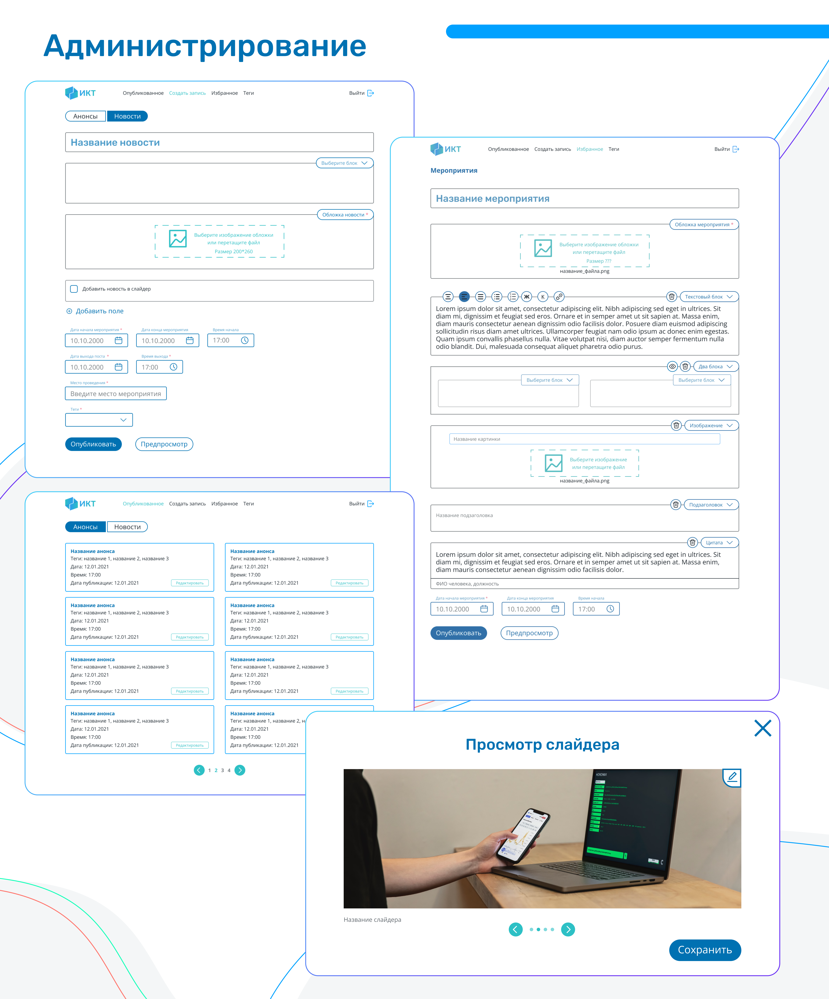

<div id="top"></div>

<!-- PROJECT LOGO -->
<br />
<div align="center">
  <a href="https://github.com/OleinikovaPolina/ict.itmo" target="_blank">
    
  </a>
  <h3 align="center">fict.itmo</h3>
  <p align="center">
    📝📅  The site is the hallmark of ITMO Faculty of ICT. <br> The site should provide accessible information about the activities of the faculty, <br> disciplines and teachers
    <br />
    <br />
    <a href="https://fict.itmo.ru/">View Demo</a>
  </p>
</div>


<!-- TABLE OF CONTENTS -->
<details>
  <summary>Table of Contents</summary>
  <ol>
    <li><a href="#about">About the project</a></li>
    <li><a href="#map">Map</a></li>
    <li><a href="#features">Features</a></li>
    <li><a href="#built-with">Built With</a></li>
    <li><a href="#project-setup">Project setup</a></li>
  </ol>
</details>

<br/>


<!-- ABOUT -->
<h2 id="about">✨ About The Project</h2>

<div class="d-flex">
  
  
</div>

The Faculty of Infocommunication Technologies is the main starting point in the development of professional skills. The site is the hallmark of ITMO Faculty of ICT. When going to the site, the entrant or his parents should have an understanding of what kind of faculty it is and what its specialization is. The site contains accessible information about the activities, information  about disciplines and teachers. There are also pages for administration.

<p align="right">(<a href="#top">back to top</a>)</p>

<!-- MAP -->
<h2 id="map">🗺️ Map</h2>

### basic
* home
  * articles
* events
  * all news
  * events, news, announcements
* for students
  * articles
* admission
  * list of directions for master's degree, bachelor's degree
    * directions pages
      * disciplines of the direction
* contacts
### admin panel
* login page
* published
  * editing
* create an entry
* favorites
  * editing
* tags

<p align="right">(<a href="#top">back to top</a>)</p>

<!-- FEATURES -->
<h2 id="features">🌟 FEATURES</h2>

* dark and light theme
* animation:
  * spinning hexagons with text appearance
  * carousel with popup oval with text
  * an arrow moving along the road and passing the marks, reaching which the text appears. at the end of the road is a book that changes the position and text
  * smooth appearance of the element when scrolling
  * lines emerging from the sides of the page
  * block with photos moving along ovals with hover effect
* admin:
  * crop photos on upload
  * changing the format of photos when previewing blocks (double and slider)
  * preview of the post, preview of blocks for articles that will lead to the article itself on the pages
  * six types of custom blocks in post creation (two blocks, text, image, slider, quote, subtitle)
  * draggable blocks
* pagination, search, news filtering
* carousels:
  * with oval blocks
  * with 6 (4) images in two lines
  * with 4 (2) zoom hover effect
  * with 1 image and height adjusted to the first one in the queue
* expansion-panel with outgoing lines

<p align="right">(<a href="#top">back to top</a>)</p>

<!-- BUILT WITH -->
<h2 id="built-with">🏗️ Built With</h2>

* Vue
* Vuex
* Vue-router
* Vue-moment
* Vuetify
* Vue2-editor
* Vuedraggable
* Vue-slick-carousel
* Vue-croppie
* Axios

<p align="right">(<a href="#top">back to top</a>)</p>

<!-- PROJECT SETUP -->
<h2 id="project-setup">⚙️ Project setup</h2>

```
npm install
```

### Compiles and hot-reloads for development
```
npm run serve
```

### Compiles and minifies for production
```
npm run build
```

### Lints and fixes files
```
npm run lint
```

### Customize configuration
See [Configuration Reference](https://cli.vuejs.org/config/).

<p align="right">(<a href="#top">back to top</a>)</p>

